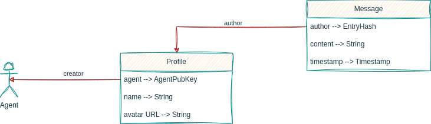

# Simple chat Holochain Application

## DNA

- Every conversation is a DNA cell
- Every message is a DNA entry

### Profile zome

Stores the user's profile

#### Entry types

- `profile`
    - `agent` -> AgentPubKey - the user's agent
    - `name` -> String - the user's name
    - `avatar_url` -> String - the user's avatar url

### Message zome

stores the messages

#### Entry types

- `message`
    - `content` -> String - the message content
    - `timestamp` -> timestamp - the message timestamp
    - `author` -> EntryHash - the message author
  
### Collections

- `profiles`
    - [x] `get_all_profiles` - returns all the profiles
    - [x] `get_profile_by_agent` - returns the profile of a given agent

- `messages`
    - [x] `get_all_messages` - returns all the messages
    - [ ] `get_messages_by_author` - returns all the messages by a given author

## Validation

- `profile` - validates the profile
    - [x] canot be deleted
    - [ ] can be updated only by the author
    - [x] Only one profile per agent
    - entry fields:
      - `agent` -> AgentPubKey - the user's agent
          - `agent` must be an agent
      - `name` -> String - the user's name
          - `name` must be a string
          - `name` must be at least 3 characters long
      - `avatar_url` -> String - the user's avatar url
          - `avatar_url` must be a string
          - `avatar_url` must be at least 3 characters long
- `message` - validates the message
    - [ ] can be updated or deleted only by the author
    - entry fields:
      - `content` - the message content
          - `content` must be a string
          - `content` must be at least 3 characters long
      - `timestamp` - the message timestamp
          - `timestamp` must be a timestamp
      - `author` - the message author
          - `author` must be an EntryHash of Profile

## Signals

- [ ] `message` - sends a signal when a message is created

